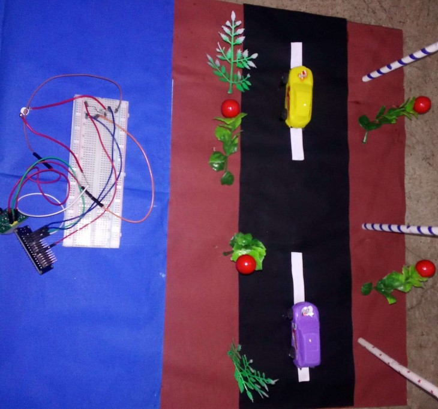

# Smart Street Lighting System (ESP32 + PIR + LDR)

This project is a **Smart Street Lighting System** that automatically controls street lights based on ambient light and human movement.  
It uses an **ESP32 microcontroller**, an **LDR** to detect day/night, and a **PIR sensor** to detect motion. At night, the lights remain **dim** to save energy, and when motion is detected, they switch to **full brightness** using PWM control via a MOSFET.  
This system reduces power consumption, enhances safety, and can be scaled for real-world smart city applications.

---

## 🔹 Features
- Automatic **day/night detection** with LDR  
- **Motion-triggered full brightness** using PIR  
- **PWM dimming** for smooth brightness control  
- Energy-efficient and cost-effective  
- Expandable for IoT/remote monitoring  

---

## 🔹 Hardware & Software
**Hardware Components**:  
See the complete [Components List](Components%20list/README.md).  

**Software Requirements**:  
- Arduino IDE (with ESP32 board support installed)  
- Required libraries: *(none beyond default Arduino functions)*  

---

## 🔹 Working Principle
1. **Daytime** → Lights remain **off**.  
2. **Nighttime (LDR detects darkness)** → Lights remain at **dim brightness**.  
3. **Motion detected by PIR** → Lights turn **full brightness** for a hold time.  
4. **No motion** → Lights gradually fade back to **dim mode**.  

---

## 🔹 Repository Structure
- `firmware/` → ESP32 Arduino code (`esp32_smart_street_light.ino`)  
- `hardware/` → wiring connections, calibration details  
- `docs/` → project report and cover page  
  - [Mini Project Report](docs/MINI%20PROJECT%20REPORT.pdf)  
  - [Mini Project Cover Page](docs/mini%20project%20COVER%20PAGE.pdf)  
- `Components list/` → [Component List](Components List/Component-List.jpg)  
- `media/` → diagrams and prototype images  
  - Block Diagram  
  - Flow Chart  
  - Circuit Diagram  
  - Prototype Photo  

---

## 🔹 Results & Report
- Prototype successfully implemented and tested.  
- Lights respond correctly to both **ambient light** and **motion**.  
- Energy savings observed during testing.  
- 📑 Full documentation available in **[docs/MINI PROJECT REPORT.pdf](docs/MINI%20PROJECT%20REPORT.pdf)**  

### Project Media
-   
-   
-   
-   

---

## 🔹 Future Scope
- Integration with **IoT dashboards** for real-time monitoring  
- **Scheduled dimming** based on time of day  
- Solar panel integration for **sustainable power**  
- Large-scale deployment using **LoRa/5G networks**  

---

## ▶️ Getting Started
1. Clone this repository.  
2. Open `firmware/esp32_smart_street_light.ino` in Arduino IDE.  
3. Select **Board: ESP32 Dev Module** and upload.  
4. Adjust LDR threshold in code after calibration.  
5. Connect hardware as per wiring details and test.  

---

## 📌 License
This project is licensed under the **MIT License**.  
